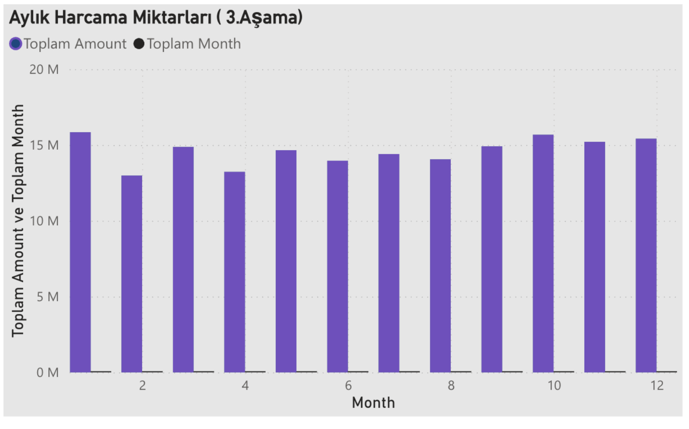

# Akbank Teknoloji Okuryazarlığı Proje Ödevi

## Konu : Kredi Kartı Harcamaları Veri Analizi

## 1.Aşama:Python ile veri görselleştirme
**Kullanılan Veri Setleri**
- users.csv: Kullanıcılara ait bilgiler
- transactions.csv: Kredi kartı harcamaları

**Yapılan İşlemler**

- Veri Yükleme ve Hazırlık
- En Fazla Harcama Yapılan Şehirler
- Saatlik Harcama Dağılımı
- Cinsiyete Göre Harcama
- Gelire Göre Harcama

##  2.Aşama:  Power BI ile Veri Görselleştirme
Bu kısımda amaç, verilmiş olan excel dosyalarını kaynak olarak kullanarak Pbi üzerinde müşteri
harcamalarını inceleyebileceğimiz bir dashboard oluşturmaktır.

- En fazla harcama yapılan 10 şehir

- Harcamaların saate , Gelir grubuna ve cinsiyete göre dağılımı

- Aylık Harcama Miktarları

